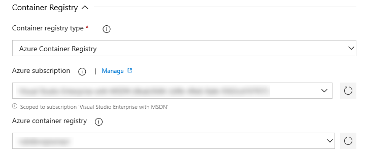
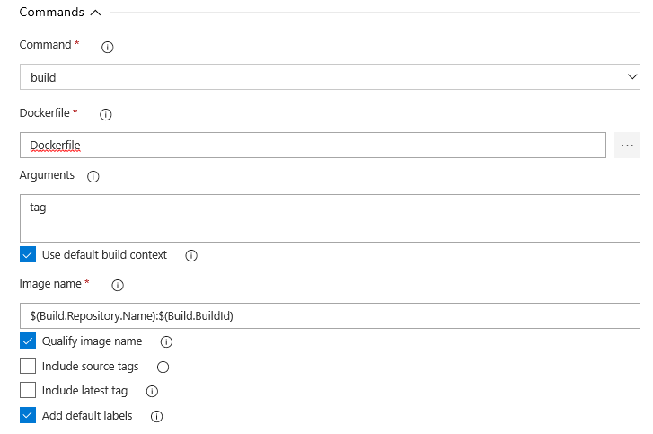
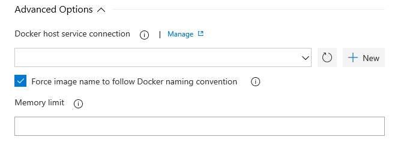

# Docker task

**Azure Pipelines | TFS 2018**

Use this task in a build or release pipeline to build, tag, push, or run Docker images, or run a Docker command. This task can be used with Docker or Azure Container Registry (ACR).

> [!NOTE]
> 
> For YAML pipelines, consider using script-based Docker commands as described in the [Docker guidance](../../languages/docker.md), and using this Docker task when working with container registries that require authentication.

The built-in Docker task enables you to build Docker images, push Docker images to an authenticated Docker registry,
run Docker images, or execute other operations offered by the Docker CLI:

* **Use Docker best practices**: By writing minimal yaml you can build and push an image which is tagged with '$(Build.BuildId)' and has rich metadata about the repository, commit, build information to the container image as Docker labels
* **Conform to Docker standards**: The task takes care of details like tagging image with the registry hostname and port image before pushing the image to a private registry like Azure Container Registry (ACR). It also helps you to follow Docker naming convention, for example, converting upper case character to lower case and removes spaces in 
  image name which can happen if you are using $(Build.Repository.Name) to name your images.
* **Manage secrets**: The task makes it easy to use either 'Docker registry service connection' for connecting to any private container registry or 'Azure Service Connection' For connecting to ACR. For example, in case of ACR you don't have to enable 'admin user' and manage username and password as secret. The task will use the Azure Service connection to login to ACR.
  Once you have used the Docker task to sign in, the session is maintained for the duration of the job thus allowing  you to use follow-up tasks to execute any scripts by leveraging the login done by the Docker task. 
  For example, You can use the Docker task to sign into ACR and then use a subsequent script to pull an image and scan the container image for vulnerabilities.

::: moniker range="> tfs-2018"

## Build Docker images

We have to build the container images before it is pushed to the ACR or Container Registry. You can use the YAML approach or Designer to configure the same.

# [YAML](#tab/yaml)

## Container Registry

You need to establish the container registry settings first to build, push and deploy container images into ACR or Container Registry.

### Using ACR approach-

Build a Dockerfile into an image with a registry-qualified name and multiple tags such as the build ID, source branch name and Git tags:

```yaml
- task: Docker@1
  displayName: 'Build an image'
  inputs:
    azureSubscriptionEndpoint: 'ContosoAzureSubscription'
    azureContainerRegistry: contoso.azurecr.io
```

**azureSubscriptionEndpoint**: input is the name of Azure Service Connection. See [Azure Resource Manager service connection](../../library/connect-to-azure.md) to manually set up the connection.

### Private Container Registries

For other private container registries (Docker Registry)

```yaml
- task: Docker@1
  displayName: 'Build an image'
  inputs:
    containerregistrytype: 'Container Registry'
    dockerRegistryEndpoint: Contoso
```

**dockerRegistryEndpoint**: input is the name of [Docker Registry service connection](../../library/service-endpoints.md).

This will result in a docker login to the container registry by using the service connection and then a docker build command will be used to build and tag the image. For example, a simplified version of the command run is:

> docker build -t contoso.azurecr.io/contoso-ci:11 .

## Commands

Once the connection is established to the ACR, we can run docker build command to build the container images. Below is the sample yaml file to build the container image.

```yaml
- task: Docker@1
  displayName: 'Build an image'
  inputs:
    azureSubscriptionEndpoint: 'ContosoAzureSubscription'
    azureContainerRegistry: contoso.azurecr.io
    dockerFile: 'docker'
    command: 'Build an image'
    arguments: tag
```

## Advanced Options

TO_BE_ADDED

By writing minimal yaml you can build and push an image which is tagged with **$(Build.BuildId)** and has rich metadata about the repository, commit, build information to the container image as Docker labels.
The task takes care of details like tagging image with the registry hostname and port image before pushing the image to a private registry like Azure Container Registry (ACR). It also helps you to follow Docker naming convention, for example, converting upper case character to lower case and removes spaces in 
image name which can happen if you are using $(Build.Repository.Name) to name your images.

# [Designer](#tab/designer)

## Container Registry

Container registry settings.

1. Select the container registry type as **Azure Container Registry**.

1. Choose the Azure Subscription from the dropdown. If not configured, select the azure subscription from the list and click on "Authorize".

1. Select an ACR. The container image will be built and pushed to this container registry.

   

## Commands

Select an appropriate docker command from the dropdown. Since we are building the image, select the command "build".

1. From the dropdown, select the command "build".

1. Map the dockerfile path.

1. Leave the default settings as is. The detailed description of all the options are described below in the Arguments section.

## Advanced Options

TO_BE_ADDED

## Push Docker images

Push Docker images with multiple tags to an authenticated Docker Registry and save the resulting repository image digest to a file.

# [YAML](#tab/yaml)

Below is the sampl yaml file to push the docker image to a ACR.

```yaml
- task: Docker@1
  displayName: 'Push an image'
  inputs:
    azureSubscriptionEndpoint: 'ContosoAzureSubscription'
    azureContainerRegistry: contoso.azurecr.io
    command: 'push'
```
This will result in a docker login to the container registry by using the service connection and then a docker push command will be used to push the image to the container registry. For example, a simplified version of the command run is:

> docker push contoso.azurecr.io/contoso-ci:11

# [Designer](#tab/designer)

Since we are pushing the docker image to a ACR, select the command "push".

1. From the dropdown, select the command "push".

1. 

1.

1.


## Build, tag and push container image

Here is an end to end sample yaml for building, tagging and pushing the container image.

```yaml
- task: Docker@1
  displayName: 'Build an image'
  inputs:
    imageName: 'contoso.azurecr.io/repositoryname:$(Build.BuildId)'
- task: Docker@1
  displayName: Login
  inputs:
    azureSubscriptionEndpoint: 'ContosoAzureSubscription'
    azureContainerRegistry: contoso.azurecr.io
    command: login
- task: Docker@1
  displayName: 'Push an image'
  inputs:
    command: 'push'
    imageName: 'contoso.azurecr.io/$(Build.Repository.Name):$(Build.BuildId)'
```

## Login to a container registry and run scripts

Task makes it easy to use either **Docker registry service connection** for connecting to any private container registry or **Azure Service Connection** for connecting to ACR. For example, in the case of ACR you don't have to enable 'admin user' and manage username and password as secret. The task will use the Azure Service connection to login to ACR.
Once you have used the task to login, the session is maintained for the duration of the job thus allowing  you to use follow-up tasks to execute any scripts by leveraging the login done by the Docker task. 
For example, You can use the Docker task to sign into ACR and then use a subsequent script to pull an image and scan the container image for vulnerabilities.

```yaml
- task: Docker@1
  displayName: Login
  inputs:
    azureSubscriptionEndpoint: 'ContosoAzureSubscription'
    azureContainerRegistry: contoso.azurecr.io
    command: login
- bash: |
   # Write your commands here
   # Use the environment variables input below to pass secret variables to this script
   docker build -t contoso.azurecr.io/repositoryname:$(Build.BuildId) . # include other options to meet your needs
   docker push contoso.azurecr.io/repositoryname:$(Build.BuildId) 
   displayName: 'Build, tag and push image'
```

## Run Docker images

Perform isolated workloads inside a container by running a Docker image. A Docker image can also be run in the background with a specific restart policy.
```yaml
- task: Docker@1
  displayName: 'Push an image'
  inputs:
    azureSubscriptionEndpoint: 'ContosoAzureSubscription'
    azureContainerRegistry: contoso.azurecr.io
    command: 'run'
    containerName: contosocontainer
    ports: 8084
    volumes: '$(System.DefaultWorkingDirectory):/src'
    workingDirectory: /src
    containerCommand: 'npm install'
    restartPolicy: onFailure
```
This will result in a docker run command. For example: 
> docker run -d --restart no atul-aks:1382

::: moniker-end

## Arguments

The arguments which are in the docker task are segregated into different sections which are listed below in the tabs.

# [Container Registry](#tab/containerregistry)


For ACR,

<table><thead><tr><th>Argument</th><th>Description</th></tr></thead>
<tr><td>Container Registry Type</td><td>Select the Azure Container Registry to connect using an Azure Service connection</td></tr>
<tr><td>Azure subscription</td><td>Select an Azure subscription</td></tr>
<tr><td>Azure Container Registry</td><td>Select an Azure Container Registry</td></tr>
</table>

For other private container registries,

<table><thead><tr><th>Argument</th><th>Description</th></tr></thead>
<tr><td>Container Registry Type</td><td>Select 'Container registry' to connect to Docker Hub or any other private container registry.</td></tr>
<tr><td>Docker registry service connection</td><td>Select a Docker registry service connection. Required for commands that need to authenticate with a registry.</td></tr>
</table>

# [Commands](#tab/commands)



<table><thead><tr><th>Argument</th><th>Description</th></tr></thead>
<tr><td>Command</td><td>Build, push, run, tag, login, logout</td></tr>
<tr><td>Dockerfile</td><td>Path to the Docker file to use. Must be within the Docker build context.</td></tr>
<tr><td>Arguments</td><td>Build-time variables for the Docker file. Specify each name=value pair on a new line.</td></tr>
<tr><td>Use default build context</td><td>Set the build context to the directory that contains the Docker file.</td></tr>
<tr><td>Image Name</td><td>Name of the Docker image to build, push, or run.</td></tr>
<tr><td>Qualify image name</td><td>Qualify the image name with the Docker registry connection's hostname if not otherwise specified.</td></tr>
<tr><td>Include source tags</td><td>Include Git tags when building or pushing the Docker image.</td></tr>
<tr><td>Include latest tag</td><td>Include the 'latest' tag when building or pushing the Docker image.</td></tr>
<tr><td>Add default labels</td><td>Add CI/CD metadata like repository, commit, build and release information to the container image by using Docker labels.</td></tr>
</table>

# [Advanced Options](#tab/advancedoptions)



<table><thead><tr><th>Argument</th><th>Description</th></tr></thead>
<tr><td>Docker host service connection</td><td>Select a Docker host connection. Defaults to the agent's host</td></tr>
<tr><td>Force image name to follow Docker naming convention</td><td>If enabled docker image name will be modified to follow Docker naming convention. Converts upper case character to lower case and removes spaces in image name.</td></tr>
<tr><td>Memory limit</td><td>The maximum amount of memory available to the container as a integer with optional suffixes like '2GB'.</td></tr>
[!INCLUDE [temp](../_shared/control-options-arguments.md)]
</table>

## Open source

This task is open source [on GitHub](https://github.com/Microsoft/vsts-tasks). Feedback and contributions are welcome.

## Q & A

<!-- BEGINSECTION class="md-qanda" -->

<!-- ENDSECTION -->
